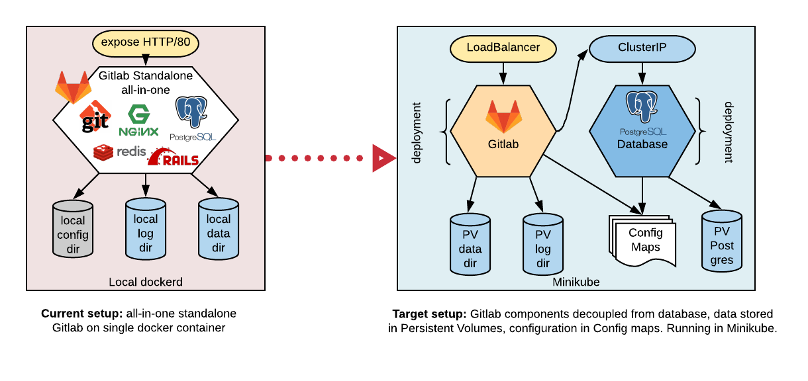

# Gitlab container to Minikube migration scenario

This scenario is meant for training purposes and only covers certain topics of application migration to Kubernetes. Additionally, it is adjusted to work with Minikube, and not necessarily with managed K8s services. Use at your own risk!

## Migration outline

The following digram outlines the migration goals, that is:
* Move from locally deployed docker to Kubernetes cluster running on Minikube
* Decouple Database from the rest of the Gitlab components
* Migrate data and logs to Persistent Volumes
* Use ConfigMaps to store parts of Gitlab and Postgres configurations
* Expose gitlab HTTP via LoadBalancer



What this does not include, but a real life scenario probably should:
* Migration to cloud-based Kubernetes cluster (managed or not)
* Decouple Redis from Gitlab
* Export any passwords to Kubernetes Secrets
* Expose Gitlab via HTTPS and add a service for sshd
* Create PVs on top of some distributed storage like EFS

<br/>

## Pre-requisistes

- Docker daemon running locally
- Minikube on top of a VM with at least 2 GB of ram and 2 CPU cores. I suggest to go with with 4 GB / 4 cores to avoid any glitches:  
  ```
  minikube start -p gitlab --cpus=4 --memory=4G --vm-driver virtualbox
  ```
  
The scenario has not been tested with a driver different than VirtualBox, hence it is recommended.
  
<br/>
  
## Step 1: Launch local standalone Gitlab container

```bash
WORKDIR=~/gitlab2k8s
mkdir -p ${WORKDIR}
cd ${WORKDIR}
sudo docker run --detach \
  --hostname gitlab.localtest.me \
  --publish 80:80 \
  --name gitlab \
  --restart always \
  --volume ${WORKDIR}/gitlab_config:/etc/gitlab \
  --volume ${WORKDIR}/gitlab_logs:/var/log/gitlab:Z \
  --volume ${WORKDIR}/gitlab_data:/var/opt/gitlab:Z \
  gitlab/gitlab-ce:12.5.3-ce.0
```

Notes:
- we cross-mount Gitlab's data, log and config directories on docker with local directories
- Gitlab needs a domain name and *.localtest.me resolves to 127.0.0.1 which we'll use, hence the --hostname setting  

Wait 3-4 minutes until Gitlab components are up - you can observe the status with 
```
# docker logs -f gitlab
```  

Once complete, go to your browser and open http://gitlab.localtest.me

There:
- set root user password and login using that pwd
- create a project and tick the checkbox to create a README file in it

^^ this is our test to ensure the data survived the migration to K8s

<br/>

## Step 2: Dump Gitlab PostgreSQL database

"Login" as gitlab-psql:  
```c
# sudo docker exec -it gitlab su - gitlab-psql
```  
and execute:  
```
pg_dump -h /var/opt/gitlab/postgresql -d gitlabhq_production > gitlabhq_production.sql
```

Detach the docker console and gracefully stop the service:
```c
# sudo docker exec -i gitlab gitlab-ctl stop
# sudo docker stop gitlab
```

<br/>

## Step 3: Migrate the data to PVC

Few notes of explanation here. The gitlab config and data is stored under ${WORKDIR}:/gitlab_*, so in theory we could easily re-use it in Kubernetes as hostPath volumes, however:
- we have this data available locally whereas Minikube works under a VM, so it doesn't have these files,
- even if we mount the directories on minikube, the 9p driver prevents Gitlab from setting file permissions and this simply won't work.

Therefore we'll use VM-based PersistentVolumes. For migration purposes, let's deploy a transitional pod on which we'll mount our local shares and newly created PVC to be able to copy the data from one to another.

<br/>

### Mount local dir on Minikube's VM

First we need to mount our workdir on Minikube's VM to be able to refer to it as a hostPath on busybox - our temporary migration pod. 

_Hint: You'll need to keep that utility running, so you might wabt to open another terminal tab, or use nohup._

```bash
minikube mount -p gitlab ${WORKDIR}:/gitlab_volumes
```

<br/>

### Create PersistentVolumes

Minikube allows dynamic volume provisioning, hence no need to create PersistentVolumes - we only need PersistentVolumeClaims

```yaml
cat << EOF | tee pvc.yml
apiVersion: v1
kind: PersistentVolumeClaim
metadata:
  name: gitlab-data-pvc
spec:
  accessModes:
    - ReadWriteMany
  volumeMode: Filesystem
  resources:
    requests:
      storage: 1Gi
---
apiVersion: v1
kind: PersistentVolumeClaim
metadata:
  name: gitlab-log-pvc
spec:
  accessModes:
    - ReadWriteMany
  volumeMode: Filesystem
  resources:
    requests:
      storage: 1Gi
EOF
```

```c
# kubectl create -f pvc.yml
```

With `kubectl get pvc` we should see output similar to this:
```
NAME              STATUS   VOLUME                                     CAPACITY   ACCESS MODES   STORAGECLASS   AGE
gitlab-data-pvc   Bound    pvc-f65ddb3f-a291-44ac-ad7e-c959336be51e   1Gi        RWX            standard       3s
gitlab-log-pvc    Bound    pvc-dccf65aa-03a9-41fd-bc44-99ff48f6e06d   1Gi        RWX            standard       2s
```

<br/>

### Create temporary migration pod using Busybox image

```yaml
cat << EOF | tee busybox.yml
apiVersion: v1
kind: Pod
metadata:
  name: busybox
  labels:
    run: gitlab
  namespace: default
spec:
  containers:
  - name: busybox
    image: busybox
    command:
      - sleep
      - "3600"
    volumeMounts:
    - mountPath: /mnt/gitlab-data
      name: gitlab-data
    - mountPath: /mnt/gitlab-data-pvc
      name: gitlab-data-pvc
  volumes:
  - name: gitlab-data
    hostPath:
      path: /gitlab_volumes/gitlab_data
  - name: gitlab-data-pvc
    persistentVolumeClaim:
        claimName: gitlab-data-pvc
EOF
```

```c
# kubectl create -f busybox.yml
```

Note: /gitlab_volumes is in fact our local $WORKDIR. We've mounted it on VM using _minikube mount_. *We need to go deeper* ;), so now we mount that previously mounted volume on the pod using hostPath volume. Does that sound nasty yet? No worries, you'd not do that in a real life scenario. Hopefully.

<br/>

### Copy the data: 

Copy the data and fix file permissions lost due to 9p driver in VirtualBox
```c
# kubectl exec -it busybox sh
```
```bash
cp -a /mnt/gitlab-data/.* /mnt/gitlab-data/* /mnt/gitlab-data-pvc/
chown -R 998.998 /mnt/gitlab-data-pvc/ # set owner to git
chown -R 997.997 /mnt/gitlab-data-pvc/redis # set owner to gitlab-redis
chown -R 996.996 /mnt/gitlab-data-pvc/postgresql # not necessary but will prevent errors in the logs
chmod 2770 /mnt/gitlab-data-pvc/git-data/repositories/ # setgid on repositories
```
Delete busybox pod once done
```c
# kubectl delete -f busybox.yml --force --grace-period 0
```

<br/>

## Step 4: Deploy Database components and import data

### Create a volume for Postgres

```
cat << EOF | tee postgres-pvc.yml
kind: PersistentVolumeClaim
apiVersion: v1
metadata:
  name: postgres-pvc
  labels:
    app: postgres
spec:
  accessModes:
    - ReadWriteMany
  resources:
    requests:
      storage: 1Gi
EOF
```

```c
# kubectl create -f postgres-pvc.yml
```

_Note: Obviously 1 Gibibyte is not quite suitable for a real life scenario, but it's enough for training purposes._

Expected output of `kubectl get pvc postgres-pvc`:
```
NAME           STATUS   VOLUME                                     CAPACITY   ACCESS MODES   STORAGECLASS   AGE
postgres-pvc   Bound    pvc-629ac3a8-3759-45a2-97ee-7de158103ed8   1Gi        RWX            standard       18s
```

<br/>

### Create Postgres Configuration

Note: in real world scenario you'd better hide the password behind a Secret object.

```
cat << EOF | tee postgres-config.yml
apiVersion: v1
kind: ConfigMap
metadata:
  name: postgres-config
  labels:
    app: postgres
data:
  POSTGRES_DB: gitlabhq_production
  POSTGRES_USER: gitlab-psql
  POSTGRES_PASSWORD: gitlab
EOF
```

```c
# kubectl create -f postgres-config.yml
```

<br/>

### Create Postgres deployment
```
cat << EOF | tee postgres-deployment.yml
---
apiVersion: apps/v1
kind: Deployment
metadata:
  name: postgres
spec:
  replicas: 1
  selector:
    matchLabels:
      app: postgres
  template:
    metadata:
      labels:
        app: postgres
    spec:
      containers:
        - name: postgres
          image: postgres:10.4
          ports:
            - containerPort: 5432
          envFrom:
            - configMapRef:
                name: postgres-config
          volumeMounts:
            - mountPath: /var/lib/postgresql/data
              name: postgredb
            - mountPath: /mnt/gitlab-data-pvc
              name: gitlab-data-pvc
      volumes:
        - name: postgredb
          persistentVolumeClaim:
            claimName: postgres-pvc
        - name: gitlab-data-pvc
          hostPath:
            path: /gitlab_volumes/gitlab_data
EOF
```

This is a longer YAML, so worth to take a longer look at it, i.e. notice _ports_ and _envFrom_ in the spec.

_Note: the purpose for mounting_ gitlab-data-pvc _volume is only for obtaining the dumped database file that has been saved under_ /gitlab_volumes/gitlab_data/posgresql/ _. Once import is completed, the volume and volumeMount pair can be deleted and the change applied to the deployment._

```c
# kubectl create -f postgres-deployment.yml
```

Expected result:  
`kubectl get deployments`
```
NAME       READY   UP-TO-DATE   AVAILABLE   AGE
postgres   1/1     1            1           2m7s
```
`kubectl get pods`
```
kubectl get pods
NAME                       READY   STATUS    RESTARTS   AGE
postgres-c5bd4985f-8fw7l   1/1     Running   0          2m10s
```
<br/>

### Expose Postgres via a Service
```
cat << EOF | tee postgres-svc.yml
apiVersion: v1
kind: Service
metadata:
  name: postgres-service
spec:
  ports:
    - name: postgres
      port: 5432
  selector:
    app: postgres
EOF
```

```c
# kubectl create -f postgres-svc.yml
```

*Important Note*: apparently Minikube has a bug that somehow breaks internal DNS resolution, therefore I advise to grab the service IP and use it instead of service DNS in Gitlab configuration below. To obtain the IP execute:
```c
# kubectl get svc postgres-service -o=jsonpath='{.spec.clusterIP}'
```

You can verify if you are impacted by this bug by executing:
```c
# kubectl exec -it busybox nslookup postgres-service
```
It should resolve to the clusterIP (you'll need to re-create your busybox).

<br/>

### Import the data to Postgres

Note: In addition to importing the dumped database, _gitlab_ role must be created manually, hence one additional step.
```c
# kubectl exec -it postgres[TAB] bash
```
```
# echo "CREATE ROLE gitlab" | psql -h localhost -d gitlabhq_production -U gitlab-psql
# psql -h localhost -d gitlabhq_production -U gitlab-psql -f /mnt/gitlab-data-pvc/postgresql/gitlabhq_production.sql > /dev/null 
```

<br/>

## Step 5: Configure and launch Gitlab

### Create Configmap

If necessary replace "postgres-service" with the clusterIP and crate the following config map:

```
cat << EOF | tee gitlab-config.yml
apiVersion: v1
kind: ConfigMap
metadata:
  name: gitlab-config
data:
  gitlab.rb: |
    postgresql['enable'] = "false"
    gitlab_rails['db_host'] = "postgres-service" #replace with svc clusterIP if DNS does not work
    gitlab_rails['db_username'] = "gitlab-psql"
    gitlab_rails['db_password'] = "gitlab"
EOF
```

```c
# kubectl create -f gitlab-config.yml
```

Please note that in real world scenario a hard-coded clusterIP is a bad design pattern. The only reason for doing so is to work around the Minikube bug.

<br/>

### Create Gitlab deployment

```
cat << EOF | tee gitlab-deployment.yml
apiVersion: apps/v1
kind: Deployment
metadata:
  name: gitlab
spec:
  replicas: 1
  selector:
    matchLabels:
      app: gitlab
  template:
    metadata:
      labels:
        app: gitlab
      name: gitlab
    spec:
      containers:
      - image: gitlab/gitlab-ce:12.5.3-ce.0
        name: gitlab
        volumeMounts:
        - mountPath: /etc/gitlab
          name: gitlab-config
        - mountPath: /var/log/gitlab
          name: gitlab-logs
        - mountPath: /var/opt/gitlab
          name: gitlab-data
        - name: config-volume
          mountPath: /etc/gitlab/gitlab.rb
          subPath: gitlab.rb
      volumes:
      - name: gitlab-config
        hostPath:
          path: /gitlab_volumes/gitlab_config
          type: Directory
      - name: gitlab-logs
        persistentVolumeClaim:
            claimName: gitlab-log-pvc
      - name: gitlab-data
        persistentVolumeClaim:
            claimName: gitlab-data-pvc
      - name: config-volume
        configMap:
          name: gitlab-config
          items:
            - key: gitlab.rb
              path: gitlab.rb
      securityContext:
        runAsUser: 0
        runAsGroup: 0
EOF
```
```c
# kubectl create -f gitlab-deployment.yml
```

As previously, it takes some 2-3 minutes for Gitlab components to get up. You can follow the process with:

```c
# kubectl logs -f gitlab[TAB]
```

<br/>

### Create a Load Balancer for Gitlab

```
cat << EOF | tee gitlab-lb.yml
apiVersion: v1
kind: Service
metadata:
  name: gitlab-lb
spec:
  type: LoadBalancer
  ports:
    - targetPort: 80
      port: 80
  selector:
    app: gitlab
EOF
```

```c
# kubectl create -f gitlab-lb.yml
```


<br/>

## Step 6: Test it

Generate your Gitlab URL using its load balancer IP:
```c
# kubectl get svc gitlab-lb -o=jsonpath='http://{.spec.clusterIP}/'
```

Use the following command to make your LoadBalancer available locally:
```
# minikube -p gitlab tunnel
```

Point your browser to the address and verify if your are able to login and whether you can see the project you commenced as well as the README.md file you created in it.


